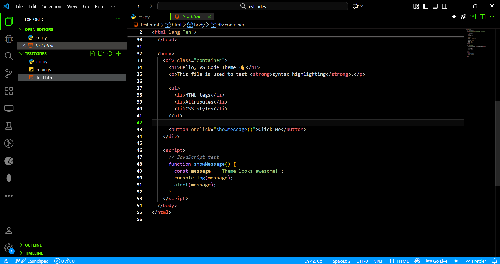
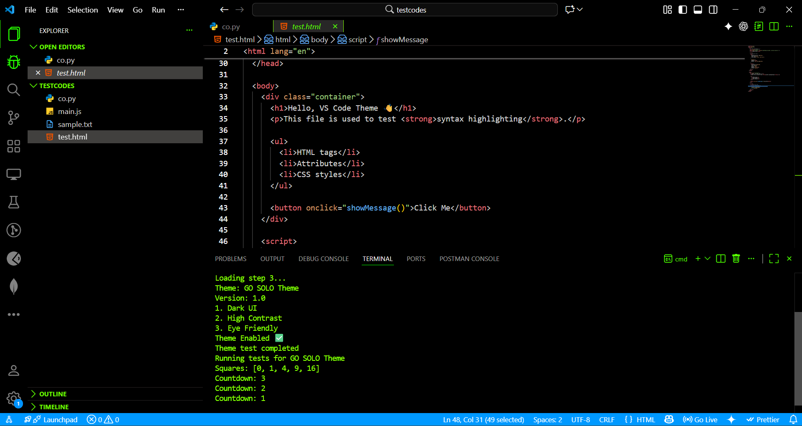
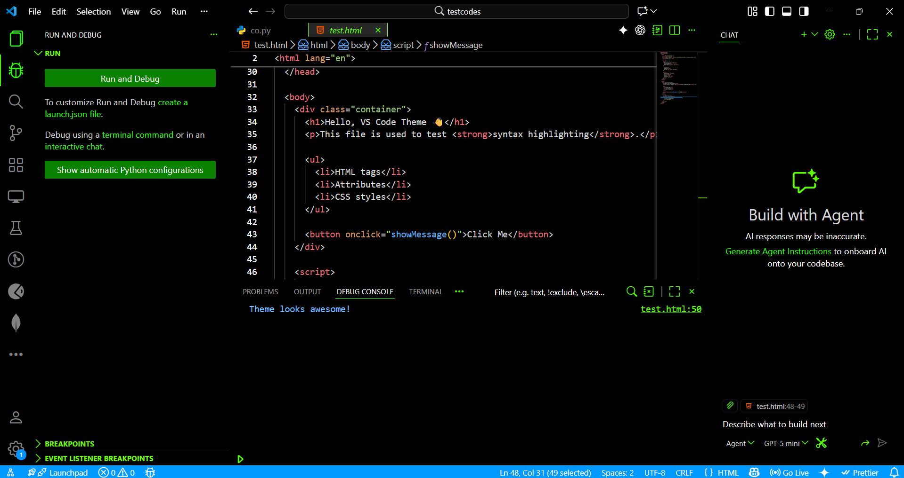

# GO SOLO Theme 🖤

GO SOLO is a pitch-black, distraction-free VS Code theme designed for deep focus, long coding sessions, and late-night work.

## ✨ Features

- True AMOLED-black background
- Eye-friendly high contrast colors
- Minimal UI with zero visual noise
- Optimized for coding

## 📦 Installation

1. Open **VS Code**
2. Go to **Extensions**
3. Search for **GO SOLO Theme**
4. Install and select it from **Preferences → Color Theme**

## 🖼 Screenshots

## 👤 Author

**RON5N**

## 🔗 Links

[GitHub](https://github.com/rahul006-max/go-solo-theme)  
[Linkedin](https://www.linkedin.com/in/rahulp-0084ba2a4/)
